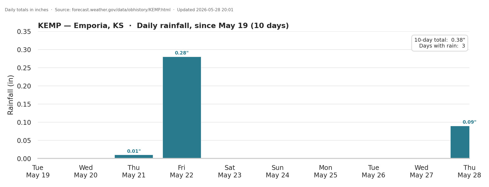

# unbound-rainfall

Daily rainfall chart for **KEMP — Emporia Municipal Airport, Kansas**, updated automatically every 3 hours and published to GitHub Pages.

**Live chart:** https://oldagency.github.io/unbound-rainfall/KEMP_rainfall_14d.png



---

## What it does

Every 3 hours, a GitHub Actions workflow:

1. **Scrapes** the NWS observation-history page for KEMP — https://forecast.weather.gov/data/obhistory/KEMP.html — which lists hourly METAR observations for the past ~3 days.
2. **Merges** new observations into a running CSV (`KEMP_obhistory_running.csv`), deduplicated by `(date, time)` so repeated runs don't double-count.
3. **Re-renders** the rainfall chart (`KEMP_rainfall_14d.png`) showing daily totals.
4. **Commits** the updated CSV + PNG back to `main`.
5. GitHub Pages re-deploys automatically on each push, so the chart at the live URL is always fresh.

## Why scrape, not use the API?

`api.weather.gov`'s `precipitationLastHour` field disagreed with the obhistory page in several spots (e.g. it was missing the 0.07" reported at KEMP on 2026‑05‑22 09:53 CDT). The NWS obhistory page parses raw METAR text directly, so to match what humans see at weather.gov we scrape that HTML rather than hit the JSON API.

## How the chart is computed

- Each `:53` hourly METAR observation reports rain that fell in the previous 60 minutes (the **1-hr precipitation** column on the obhistory page).
- The chart **sums those 1-hr values per day** (in local CDT) to get a daily total.
- Non-`:53` SPECI observations are skipped to avoid overlapping the standard hourly window.
- The 3-hr and 6-hr columns are deliberately ignored — they are rolling cumulative windows ending at each observation (the 3-hr value *includes* the 1-hr; the 6-hr *includes* both), so charting them alongside the 1-hr is confusing rather than informative.

The chart's left edge is anchored to the **oldest day in the running CSV**, growing forward as more data accumulates. Once the span reaches 14 days, the chart becomes a standard 14-day rolling window (oldest day drops off as a new one is added).

## Files

| File | What it is |
|---|---|
| `run_update.py` | The whole pipeline: scrape → merge → render chart. Safe to run repeatedly; deduplicates by (date, time). |
| `requirements.txt` | Python deps (`matplotlib`, `seaborn`). |
| `.github/workflows/update.yml` | The 3-hour cron job that runs `run_update.py` on GitHub's runners and commits results back. |
| `KEMP_obhistory_running.csv` | All scraped observations, growing over time. Newest row first. |
| `KEMP_rainfall_running.csv` | Subset of the above — only rows with a non-empty precipitation value. |
| `KEMP_rainfall_14d.png` | The chart, regenerated on every run. |
| `index.html` | Pages root — redirects to the PNG so `oldagency.github.io/unbound-rainfall/` lands on the chart. |
| `update.log` | Local-only log of script runs (gitignored). |

## Schedule

Defined in `.github/workflows/update.yml`:

```yaml
schedule:
  - cron: "0 */3 * * *"   # every 3 hours, on the hour, UTC
```

That fires at `00:00, 03:00, 06:00, 09:00, 12:00, 15:00, 18:00, 21:00` UTC. GitHub Actions cron can be delayed 5–15 minutes during peak load, but a missed run is harmless — the next run still picks up everything new.

Manual runs are also available: **Actions → Update KEMP rainfall → Run workflow**.

## Running locally

```bash
pip install -r requirements.txt
python run_update.py
```

Outputs land next to the script. Re-running is idempotent thanks to the dedupe step.

## Caveats

- **3-day data window from NWS.** The obhistory page only retains roughly the last 3 days. We rely on the every-3-hour scrape to keep building up history in `KEMP_obhistory_running.csv`. If a run is missed and a gap forms longer than 3 days, those observations are gone — there's no way to backfill them from this source. For deeper historical data, use the [Iowa State ASOS archive](https://mesonet.agron.iastate.edu/request/download.phtml) instead.
- **Timezone.** The page reports times in CDT (Central Daylight Time). Daily buckets are computed in `America/Chicago` local time.
- **Trace amounts.** The page reports `T` for trace precipitation; the script treats those as 0.005 in for charting purposes.
